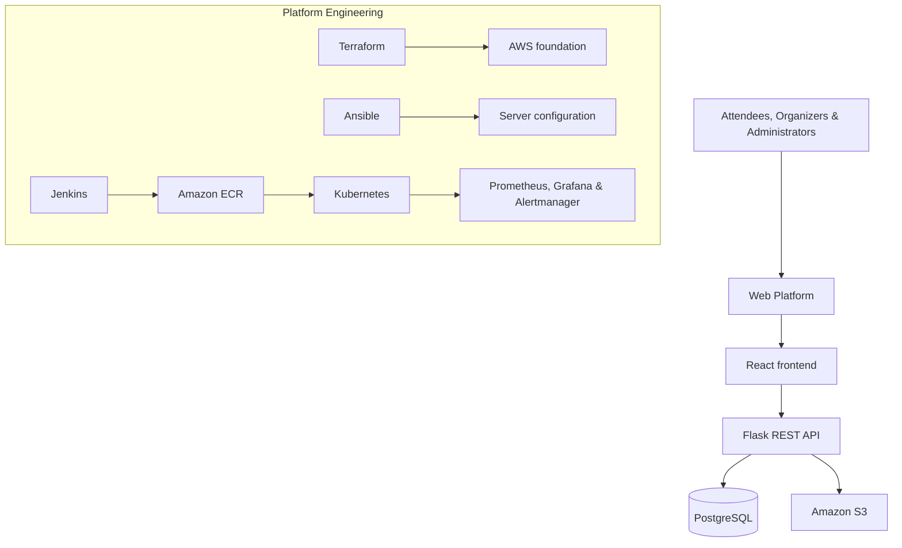

# EventSphere Cloud Platform

> **A cloud-native event management platform built using modern DevOps practices on AWS.**

EventSphere is a production-inspired platform for organizations that create, publish, and operate events at scale. This repository demonstrates the complete lifecycle of a cloud application: requirements and architecture, infrastructure as code, full-stack development, containerization, CI/CD, Kubernetes, observability, security automation, and operational configuration.

## Portfolio objectives

This is an intentionally documented, end-to-end portfolio project for Cloud Engineer, DevOps Engineer, and Junior Platform Engineer roles. It focuses on explaining engineering decisions—not merely deploying tools.

## Platform at a glance



## Delivery roadmap

| Sprint | Milestone | Outcome |
|---|---|---|
| Sprint 0 | `v0.1.0` | Project foundation, requirements, standards, and design package |
| Sprint 1 | `v0.1.0` | Architecture diagrams and technical design (completed within planning release) |
| Sprint 2 | `v0.2.0` | Modular Terraform AWS infrastructure |
| Sprint 3 | `v0.3.0` | Full-stack application core |
| Sprint 4 | `v0.4.0` | Docker and Docker Compose environment |
| Sprint 5 | `v0.5.0` | Jenkins CI/CD and DevSecOps quality gates |
| Sprint 6 | `v0.6.0` | Kubernetes deployment platform |
| Sprint 7 | `v0.7.0` | Monitoring, alerting, and observability |
| Sprint 8 | `v0.8.0` | Ansible operational automation |
| Release | `v1.0.0` | Production-readiness evidence and portfolio release |

## Repository layout

```text
├── docs/           # Project Book, guides, requirements, and runbooks
├── architecture/   # Diagrams and Architecture Decision Records (ADRs)
├── terraform/      # AWS infrastructure as code
├── application/    # React, Flask, and database assets
├── docker/         # Container build and local composition assets
├── jenkins/        # Declarative CI/CD pipeline definitions
├── kubernetes/     # Kubernetes manifests and Helm assets (if adopted)
├── monitoring/     # Metrics, dashboards, alerts, and observability config
├── ansible/        # Server configuration and operational playbooks
└── scripts/        # Repeatable developer and platform utility scripts
```

## Documentation

The Project Book is versioned in [`docs/`](docs/README.md). It is Markdown-first so that documentation is reviewed, changed, and released alongside the platform.

## Status

**Current milestone:** Sprint 0 — Project Foundation  
**Current release target:** `v0.1.0` — Planning & Design

> This is a portfolio project. Its architecture is production-inspired, while actual cloud deployments will include explicit cost controls, security safeguards, and teardown instructions.
